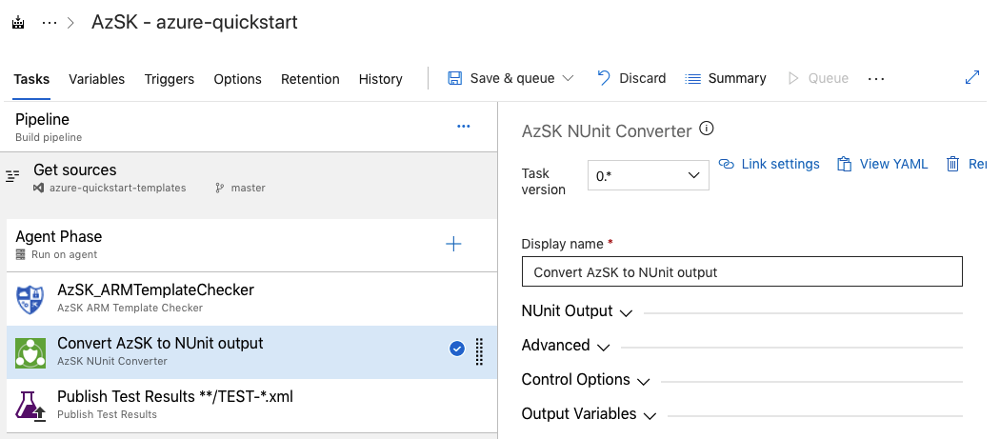

# Introduction 
A simple utility to convert AzSK output to NUnit style for use in Azure DevOps.

The tool uses [Pester](https://github.com/pester/Pester) as the conversion engine from AzSK to NUnit.

# Getting Started
This tool requires the AzSK toolkit to be installed within the same pipleine. More information on this can be found in [azsk](https://azsk.azurewebsites.net)

# Build and Test
This tool can be dropped in between the  `AzSK_ArmplateChecker` and `Publish Test Results` Azure DevOps Tasks as shown below

## Extension Features
1. The NUnit tests are exported as an Ouytput varibale, the default value for this is `AZSK.NUnit.OutputPath`.

1. Failing Tests can also be reported as errors - useful in PR and CI use cases.

# Contribute
To assist in the development of this extension then please contact me via azsk@almmechanics.com.

If you have any issues with the tool, then please add issues via  https://github.com/almmechanics/AzskUtils