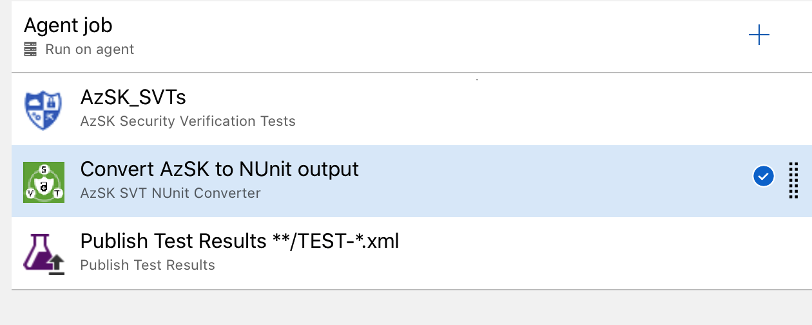
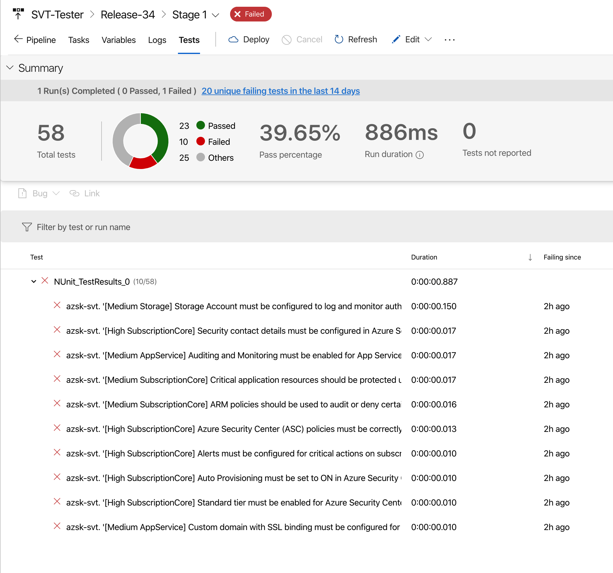

# Introduction 
A simple utility to convert AzSK output to NUnit style for use in Azure DevOps.

This extension works with the following output from the AzSK toolkit:
* ARM analysis
* SVT analysis

The tool also uses [Pester](https://github.com/pester/Pester) as the transformation engine from AzSK output to NUnit.

# Getting Started
This tool requires the AzSK toolkit to be installed within the same pipleine. More information on this can be found in [azsk](https://azsk.azurewebsites.net)

# ARM Template analysis

## Build and Release pipeline usage
This tool can be dropped in between the `AzSK_ArmTemplateChecker` and `Publish Test Results` Azure DevOps Tasks as shown below

### Output

The following image shows the NUnit output of the AzSK analysis of the `101-1vm-2nics-2subnets-1vnet` subfolder from the https://github.com/Azure/azure-quickstart-templates repository

### Extension Features
1. The NUnit tests are exported as an Output variable; the default value for this is `AZSK.NUnit.OutputPath`.

1. Failing Tests can also be reported as errors - useful in PR and CI use cases.

# SVT Template analysis

## Release pipeline usage
This tool can be dropped in between the `AzSK_SVTs` and `Publish Test Results` Azure DevOps Tasks as shown below.

### Output

The following image shows the NUnit output of the AzSK analysis from a test resource group.

### Extension Features
1. The NUnit tests are exported as an Output variable; the default value for this is `AZSK.NUnit.OutputPath`.

1. Failing Tests can also be reported as errors.

# Contribute
To assist in the development of this extension then please contact me via azsk@almmechanics.com.

If you have any issues/feature requests then add them through https://github.com/almmechanics/AzskUtils